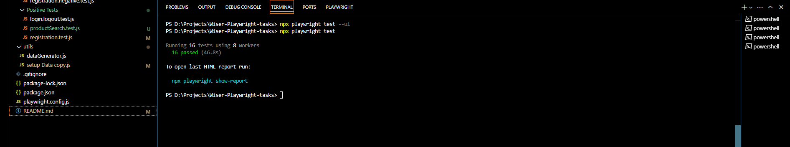
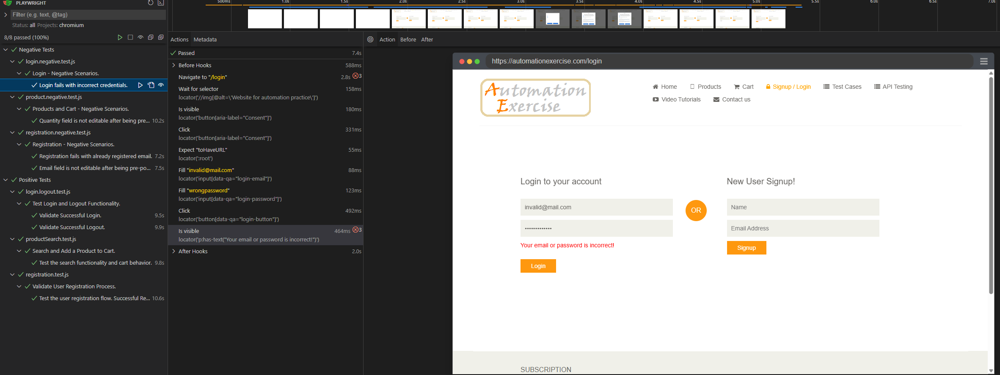
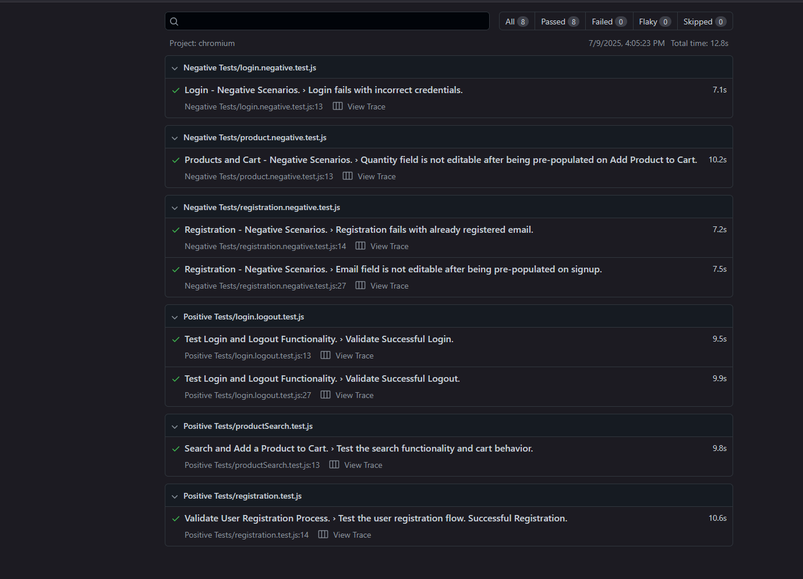

# Wiser UI Automated Tests with Playwright

## Project Overview

This project contains automated UI tests using Playwright for the publicly accessible website [www.automationexercise.com](www.automationexercise.com). The tests are designed to simulate real-world conditions by validating navigation, DOM structure, and dynamic form behavior.

## Main Objectives

- **Test the user registration flow.**  
  - The user should be successfully registered.
  - The success message ("Account Created!") should be visible.

- **Test the search functionality and cart behavior.**  
  - Search results should match the query.
  - The product added to the cart should match the selected product.
  - The cart details should reflect the correct information.

- **Test Login and Logout Functionality.**  
  - The user should be logged in successfully with the username displayed.
  - After logging out, the user should be redirected to the homepage, and the "Signup / Login" link should appear.

## Technical Requirements

- Built with [Playwright](https://playwright.dev/) using the `@playwright/test` framework.  
- Source code is maintained in a Git repository (GitHub/GitLab).  

## Test Coverage

- The tests cover both **Positive (Happy Path)** scenarios where expected flows work correctly.
- The tests also include **Negative scenarios** to verify the application behavior under invalid or unexpected inputs.

## How to Run Tests

1. After cloning the repository, install the dependencies:  
    - npm install

2. To run tests in headless mode (without browser UI):
    - npx playwright test

Example Terminal Output:

3. To run tests in UI mode (with Playwright Test Runner UI):
    - npx playwright test --ui

Example Terminal Output:

4. To view the test reports after the run:
    - npx playwright show-report

Example Terminal Output:

## NOTES
### Browser Configuration
In the playwright.config.js file, tests are configured to run only on Firefox and Chrome browsers. The reason is that i don't have Safari (WebKit engine) on my Machine,
therefore if you don't have Webkit configured as well, when you run the command "npx playwright test" and the execution begins on Firefox, Chrome and Webkit - all tests
will fail for Webkit(only).

